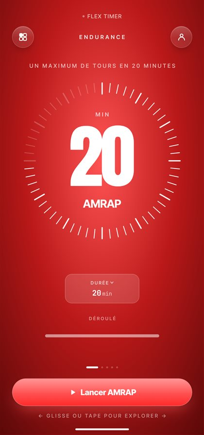
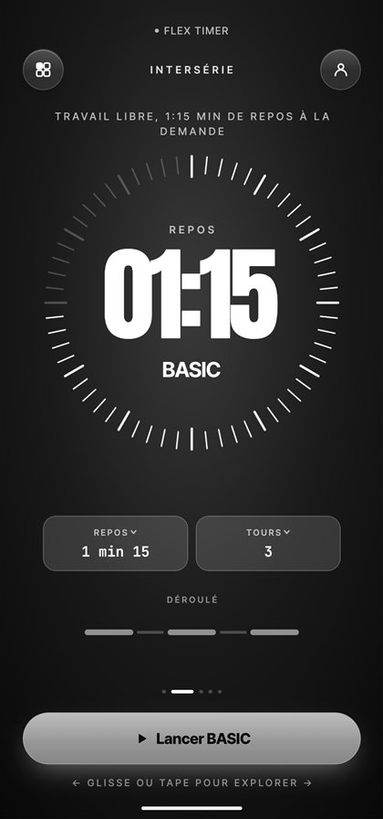
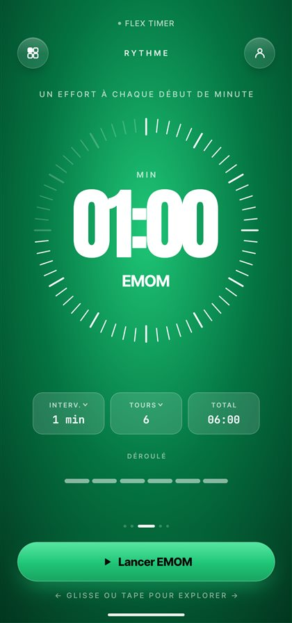
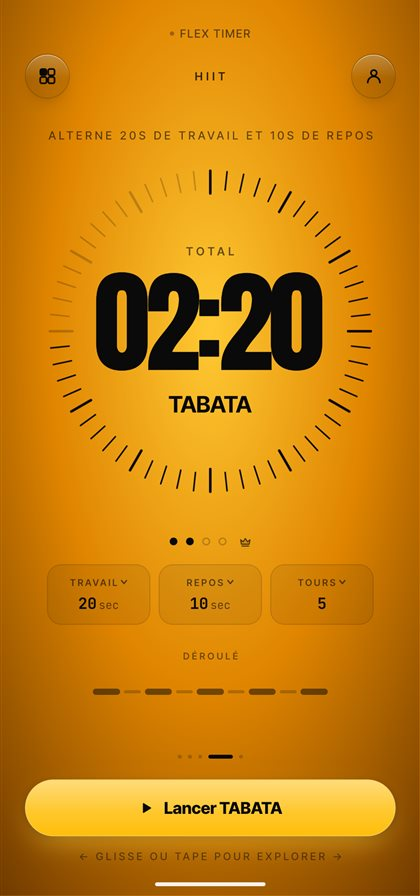
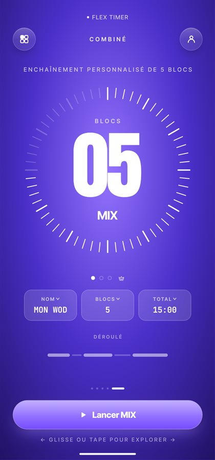

# Flex Timer

Application mobile de chronométrage sportif, faite par un sportif pour les sportifs. Pas de pub, pas de revente de données, un compte facultatif.

Site : [flextimer.netlify.app](https://flextimer.fit/)

> **Statut : bêta privée sur Android.** L'app n'est pas encore sur le Play Store. Les retours des testeurs façonnent chaque version.

<p align="center">
  
  
  
  
  
</p>

Flex Timer est pensée pour ton plaisir personnel : tu choisis librement comment tu t'en sers, du simple chrono de série au MIX composé sur mesure.

## Les cinq façons de s'entraîner

| Mode | Pour quoi faire |
|---|---|
| **AMRAP** | Un maximum de tours dans le temps donné |
| **BASIC** | Travail libre, repos minuté : le chrono des séries à la salle ou en street workout |
| **EMOM** | Un effort au début de chaque minute |
| **TABATA** | Alterner effort et repos (20 s / 10 s ou ce que tu règles) |
| **MIX** | Enchaîner plusieurs exercices et plusieurs modes dans une seule séance |

## Ce que l'app fait

- **Constructeur MIX** : compose ta séance bloc par bloc, partage-la par lien ou publie-la dans le fil public, où les autres peuvent la tester, la noter et la commenter.
- **Planning de la semaine** : prépare tes exercices (charges, séries, repos) et lance-les d'un geste.
- **Historique et statistiques** : volume, régularité, temps sous tension, répartition par mode. Un MIX compte pour ses exercices.
- **Trophées** par mode, de bronze à or.
- **Coach vocal** : annonce les phases pour t'entraîner sans regarder l'écran, en mode discret ou détaillé.
- **Mode pluie** : maintiens un bouton un instant pour éviter les appuis ratés avec les mains mouillées.
- **Chrono fiable** : il continue écran éteint, avec une notification de séance.

## Sous le capot

React Native avec Expo (expo-router), Reanimated pour les animations, react-native-svg pour l'anneau à graduations, Supabase pour le compte et le fil public (chaque table protégée par des règles d'accès au niveau des lignes). Les mises à jour de l'interface sont livrées par EAS Update.

## Lancer le projet

```bash
npm install
npx expo start
```

Scanne le code QR avec Expo Go, ou construis un APK avec EAS (`eas build --platform android --profile preview`). Le compte et le fil public demandent un projet Supabase : les clés publiques se règlent dans `app.json`, les tables dans les fichiers `supabase-*.sql`.

## Contact

Idées, bugs, retours : via le bouton Contact dans les Paramètres de l'app, ou en ouvrant une issue ici.
